# Detailed Login Flow

```mermaid
sequenceDiagram
    participant Client
    participant Gateway as API Gateway (8765)
    participant Auth as Auth Service (8081)
    participant UserService as CustomUserDetailsService
    participant MySQL

    Note over Client, Gateway: Step 1 - Client sends POST /auth/login {email, password}
    Client->>Gateway: POST /auth/login\n{email, password}
    Note over Gateway: SecurityConfig.java checks permitAll()\nNo JWT required

    Note over Gateway, Auth: Step 2 - Gateway routes to Auth Service\nStripPrefix=1, asks Eureka
    Gateway->>Auth: Forward to /login

    Note over Auth: Step 3 - Extract email/password
    Auth->>Auth: loginRequest = {email, password}

    Note over Auth: Step 4 - Create Authentication Token
    Auth->>Auth: UsernamePasswordAuthenticationToken(email, password)

    Note over Auth: Step 5 - AuthenticationManager.authenticate()
    Auth->>UserService: loadUserByUsername(email)

    Note over UserService, MySQL: Step 6 - Query DB
    UserService->>MySQL: SELECT * FROM users WHERE email='test@example.com'
    MySQL-->>UserService: Returns user with BCrypt password hash

    Note over UserService, Auth: Step 7 - Wrap User in UserDetails
    UserService-->>Auth: CustomUserDetails(user)

    Note over Auth: Step 8 - Verify Password
    Auth->>Auth: passwordEncoder.matches(typed, dbHash)
    Note over Auth: ✅ Match → continue\n❌ No match → BadCredentialsException

    Note over Auth: Step 9 - Authentication Successful → Create JWT
    Auth->>Auth: JwtClaimsSet {iss, sub, iat, exp, scope}\nSign with RSA Private Key

    Note over Auth, Client: Step 10 - Return JWT Token
    Auth-->>Client: { "token": "eyJraWQiOiI5YzUxY2FhMC04M..." }


```

# Authentication Flow

## LOGIN REQUEST

## PROTECTED REQUEST

📚 Summary
Login = Get Token

Client sends email/password to Gateway

Auth Service checks database

Password verified with BCrypt

JWT is created and signed with Private Key

Token is returned to client

Using Token = Access Protected Resources

Client sends request with Authorization: Bearer <token>

Gateway fetches Public Key from Auth Service

Gateway verifies JWT signature and expiration

If valid, request is forwarded to Auth Service

Response is returned

Why it's secure

Token is signed → cannot be forged

Token expires → cannot be reused forever

Stateless → no session storage needed

Distributed → any service can verify

✅ Your system is working perfectly! 🎉
